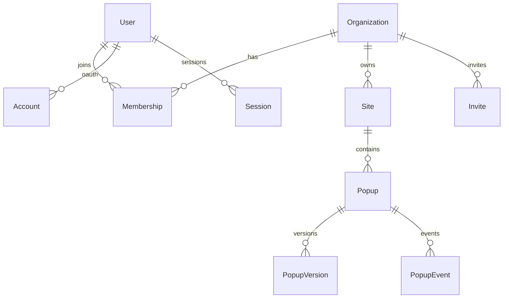
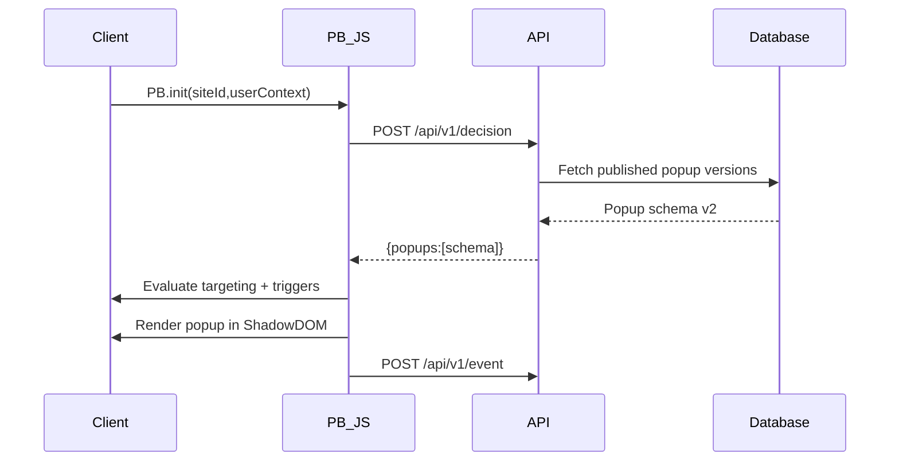

# Popup Builder Architecture

## Data Model (high level)


## Popup Delivery Flow


## API Surface
- `POST /api/v1/decision` returns published popup schemas.
- `POST /api/v1/event` logs events (impression, click, close).
- `POST /api/v1/upload` stores images in `public/uploads`.

## Builder Schema v2
```json
{
  "schemaVersion": 2,
  "blocks": [],
  "template": { "layout": {} },
  "triggers": [],
  "frequency": {},
  "targeting": []
}
```
